# Norfolk ServiceHub

**A resident asks the council for something — hire the hall, approve a shed, report a pothole — and the same application is the counter where staff check, question, decide and deliver.** Norfolk ServiceHub is both sides of that counter in one open-source web app: a public service catalogue and personal account for residents and businesses, and a staff workspace that carries every request through to a result — an answer, an issued document, a completed job or a closed hire — with payments, deadlines and history kept straight. A submitted form is only the beginning; the software's job is to help staff finish the work or give a clear reason why they can't.

## Live demo

**https://norfolk.shelfcompass.com**

Open `/demo` and sign in as a persona with one click — walk a story from both sides of the counter. Residents (Alexey, Ben) sign in instantly; staff personas complete a second step with a code from the on-screen **Demo authenticator**. The demo data is wiped and re-seeded every few hours — the banner shows the next reset.

## Honest disclaimer

- **All people, cases, documents and payments are fictional.** Nothing on the demo site is a real request or a real resident.
- **This project is not affiliated with, endorsed by, or connected to Norfolk Island Regional Council (NIRC).** It is an independent demonstration built from public information (the council's published forms, fees schedule and service pages).
- **External services are built-in mocks.** DemoPay (payments), DemoMail (email/SMS), the records systems (Content Manager, Civica Altitude) and the AI helper run inside the same process under `/mock/**` — but the technical cycle around them is real: hosted checkout, signed webhooks, idempotency, retries, an integration outbox and outage recovery.
- **Prices are a demonstration copy of the published FY2026-27 fees schedule** — every price in the UI is labelled *"FY2026-27 schedule (demo copy — confirm with Council)"*. Unsourced amounts are marked illustrative.

## Screenshots

| | |
|---|---|
| 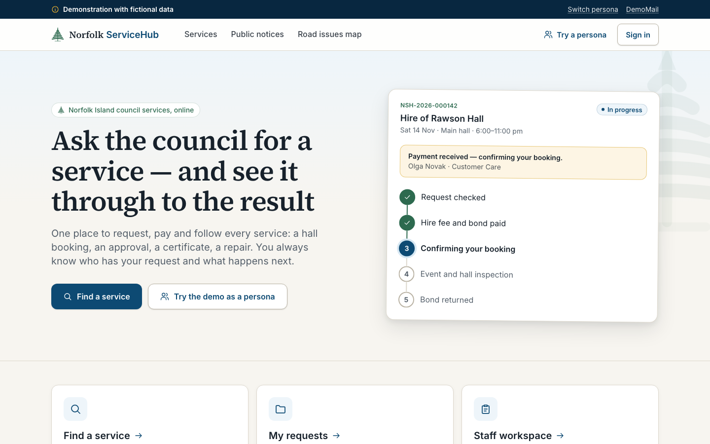 | 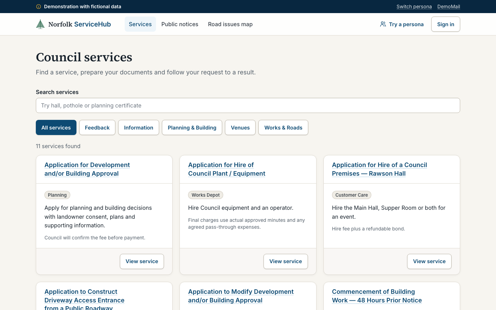 |
| 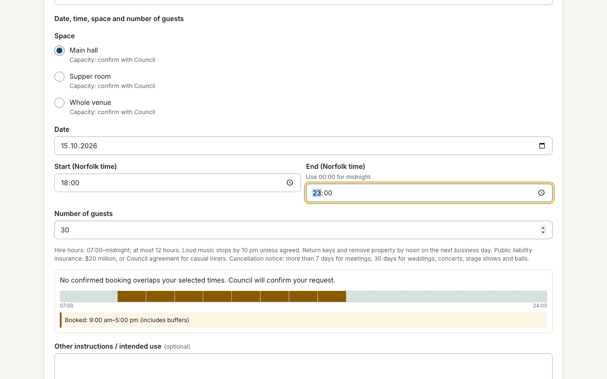 | 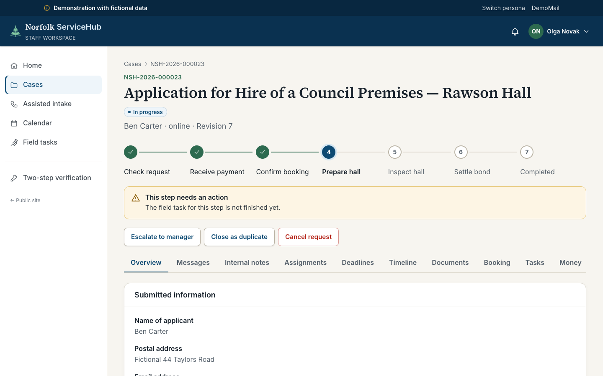 |
| 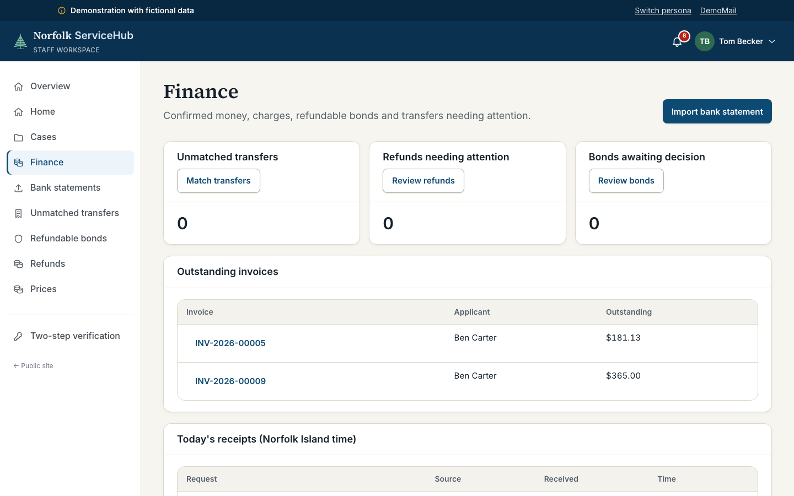 | 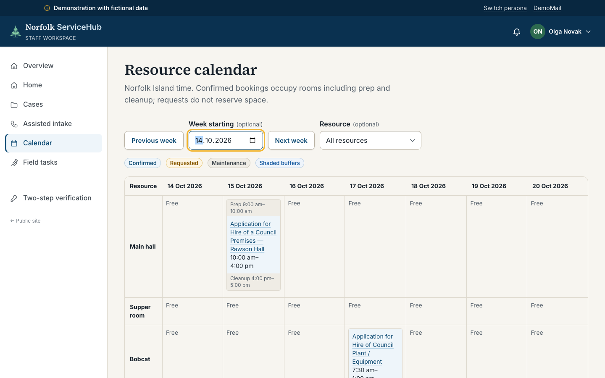 |
| 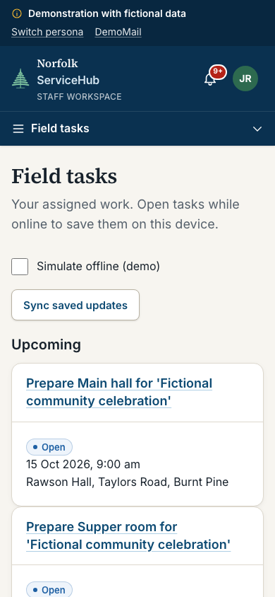 | 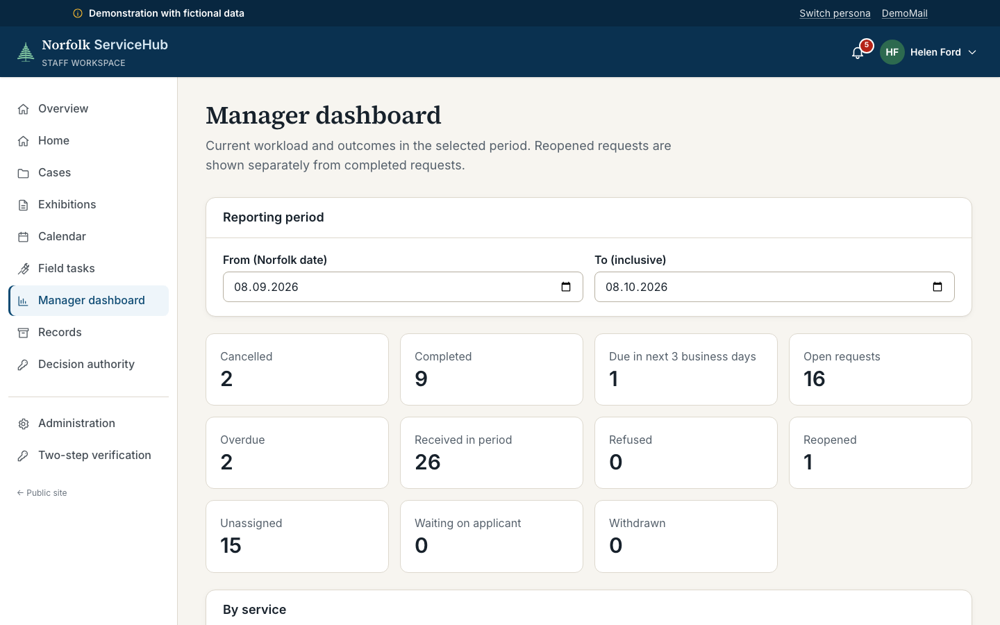 |
| 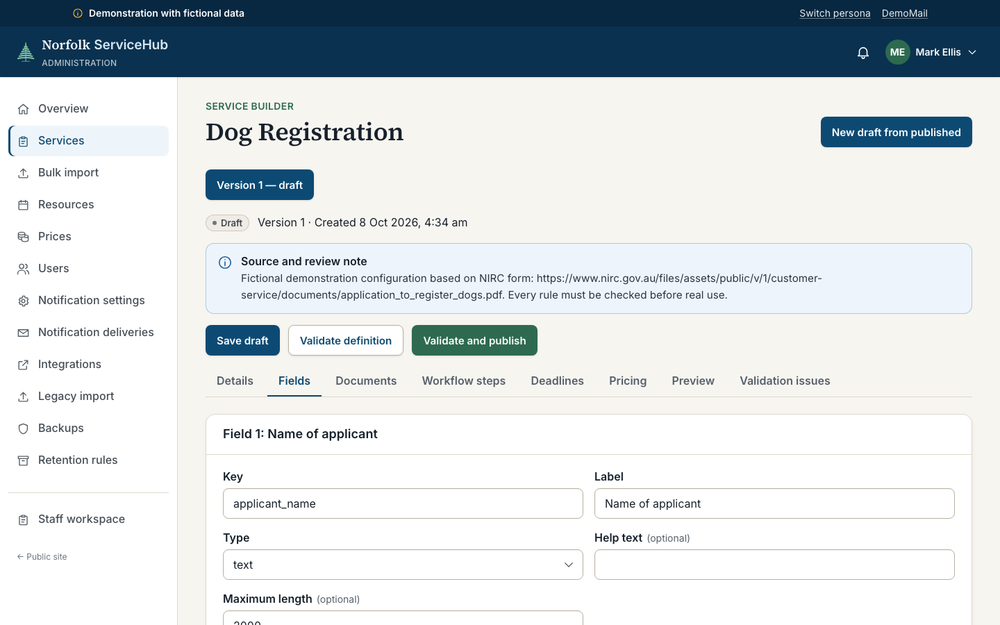 | 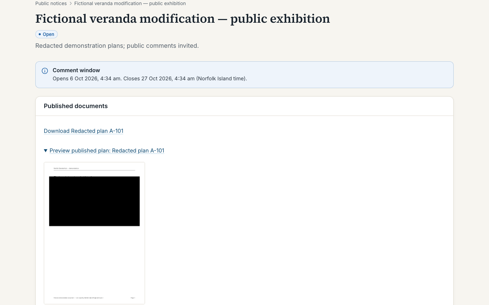 |

## Seven stories to walk through

The demo is built around seven complete stories — detailed in the presenter guide. Each takes a couple of minutes; [docs/DEMO-GUIDE.md](docs/DEMO-GUIDE.md) has a presenter script for each.

1. **Alexey hires Rawson Hall** — Alexey picks a date and rooms against live availability, Olga checks the request, Alexey pays the hire fee and refundable bond through the DemoPay checkout, staff confirm, Jake prepares and inspects the hall, and Tom settles the bond. A separate past, inspected booking for Alexey makes this step available live — a partial retention shows its reason, and the refund only says "completed" after the payment provider confirms it. A reschedule keeps the old booking, reprices the fee and preserves the paper trail.
2. **Building approval with a revised drawing** — a builder lodges a development application; the specialist comments on the site plan; the applicant uploads version 2 (version 1 stays on file); separate development and building approvals are issued as PDFs that name the exact evidence version. The same project later collects a commencement notice and a modification application — and a public exhibition publishes pixel-redacted copies approved by a second staff member.
3. **A planning certificate** — the s.98 fee is invoiced when staff advance intake to the Payment step and the workflow cannot move until it is settled; after payment the specialist prepares the certificate and a different authority holder issues it, and the exact issued version stays with the request.
4. **Equipment hire billed on actual hours** — a request for four hours becomes a scheduled machine and operator; the field worker records five and a half actual hours with downtime and agreed expenses, finance approves it, and the final invoice shows exactly how the amount was calculated.
5. **A road issue, reported and answered** — a pothole is pinned on the public map with a photo (the reporter's identity never leaves the case); staff triage it, a field worker records the inspection and repair, and the applicant receives a written response — the case closes only when a letter has been issued, not when an email was forwarded.
6. **A confidential complaint** — a complaint about a staff member goes to the complaints officer and is excluded from that staff member's view — case, documents, search and dashboards all return "not found". A later request for review stays linked to the original.
7. **A new service, created by an administrator** — the sysadmin assembles a new service in the builder (fields, documents, workflow steps, deadlines, prices), checks it in a draft preview and publishes it — a resident then completes it end to end, and editing the form afterwards never rewrites the earlier submission.

## What's inside — mapped to the product brief

The brief's full requirement list (§6, items 1–23) and where each lives — the same table with verification steps and honest status notes is in [docs/BRIEF-COVERAGE.md](docs/BRIEF-COVERAGE.md).

| § | Requirement | Status |
|---|---|---|
| 1 | Personal & business accounts; representatives; revocation cuts access | ✅ Implemented |
| 2 | Service catalogue that explains outcome, documents and price; everyday-word search | ✅ Implemented |
| 3 | Staff build new services (fields, documents, workflow) without code | ✅ Implemented |
| 4 | Bulk import of prepared service descriptions; AI may suggest, never decides | ✅ Implemented (mock AI) |
| 5 | Drafts, autosave, submit once, immutable submission snapshots | ✅ Implemented |
| 6 | Assisted intake for phone / walk-in / post without an account | ✅ Implemented |
| 7 | Assignment, collaborators, escalation, full hand-over history | ✅ Implemented |
| 8 | Per-document comments, version history, internal notes separated from applicant messages | ✅ Implemented |
| 9 | Decisions prepared → issued by an authorised officer; refusals recorded; sysadmin ≠ authority | ✅ Implemented |
| 10 | Building project history: application, approvals, modification, notices linked | ✅ Implemented |
| 11 | Public exhibition with genuine redaction (burned pixels, no text layer), second-staff approval | ✅ Implemented |
| 12 | Room calendar with buffers; incompatible bookings can't both be confirmed | ✅ Implemented |
| 13 | Equipment: assigned plant + operator, actual time/downtime/expenses → final invoice | ✅ Implemented |
| 14 | Fixed & hourly prices, deposits, scheduled future rates; old invoices keep old rates | ✅ Implemented |
| 15 | Online payment via signed webhooks, bank statement import & matching, partial/over-payment, dedupe | ✅ Implemented |
| 16 | Bond held separately; itemised retention; refund only "done" when the provider/bank confirms | ✅ Implemented |
| 17 | Field tasks on a phone, photos, offline drafts that sync when the signal returns | ✅ Implemented |
| 18 | Confidential complaints: subject excluded, linked reviews, never on public surfaces | ✅ Implemented |
| 19 | Per-service deadlines in business or calendar days; waiting-on-applicant pauses with caps | ✅ Implemented |
| 20 | Completed-case archive: search, retention rules, legal hold, controlled disposal | ✅ Implemented |
| 21 | Manager dashboard: every number drills down to its cases | ✅ Implemented |
| 22 | Legacy import with duplicate detection; full case export; integration outbox with retry | 🔶 Mechanism real — receivers are mocks (real council systems can't be verified) |
| 23 | Admin manages users, services, prices, notification addresses; sees delivery errors & backups | ✅ Implemented |

Email/SMS go to the built-in DemoMail mock; payments go through the built-in DemoPay mock. Demo defaults contact only these mocks. Administrators can configure integration endpoints; real payment and mail provider adapters remain to be implemented. Outside demo mode `/mock/**` is absent and online Pay is hidden; counter and bank payments remain available.

## Architecture

One deployable unit: a Rust binary that serves the API, the compiled React app, the background worker and the mock external services, against a SQLite database and a content-addressed blob directory — both under one `DATA_DIR`.

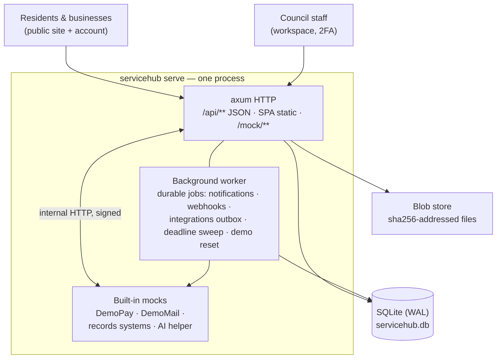

- **Backend** — Rust, axum, sqlx + SQLite (`server/`). Every state change is a `BEGIN IMMEDIATE` transaction with an audit row and a case event; concurrency uses optimistic revisions plus idempotency keys. One module owns each table group; cross-module writes go through transactional APIs.
- **Frontend** — React 19 + TypeScript + Vite, TanStack Query, Tailwind CSS (`web/`). Feature folders register routes, nav items, case-page panels and custom field widgets through `web/src/registry.ts`.
- **Access control** — all case-visibility rules live in one place (`server/src/authz.rs`); a SQL projection enforces the same rules across lists, search, counts and exports. Confidential cases are invisible — not just hidden — to unauthorised staff.
- **Service definitions** — services are data (fields, required documents, workflow steps, deadlines, pricing) stored as versioned JSON. A submission freezes the definition snapshot, so editing a service never rewrites an existing case.
- **Money** — integer cents, invoice lines with per-line settlement, credit notes, deposits held separately, refunds that complete only on a signed provider callback or a confirmed bank transfer. A journal keeps every case's ledger zero-sum.
- **Time** — stored in UTC, reasoned about in `Pacific/Norfolk`; deadlines land at 17:00 Norfolk time and understand business days, public holidays and pause caps.

Full details: [docs/ARCHITECTURE.md](docs/ARCHITECTURE.md). The real-council research behind service names, forms and prices: [docs/research/](docs/research/).

## Quick start

### Docker (one container)

```sh
cp .env.example .env
# For a local demo set in .env:  DEMO_MODE=true   COOKIE_SECURE=false
docker compose up --build -d
# A fresh database seeds automatically when DEMO_MODE=true.
```

Open http://localhost:8080 — the `/demo` page lists the personas. The container listens on `127.0.0.1:8080` only; put your reverse proxy with TLS in front for anything else (see `deploy/`).

### Self-hosted bootstrap

Set `DEMO_MODE=false`, then initialise the catalogue and the first administrator:

```sh
docker compose exec servicehub servicehub seed-catalogue
docker compose exec servicehub servicehub create-admin --email admin@example.org --name "Council administrator"
```

`seed-catalogue` loads services, prices, resources, templates, retention policies and holidays, with no fictional people or cases. `create-admin` prints a one-time password; the first administrator also has the manager role to establish governance. Sign in at `/login`, enrol a TOTP authenticator and replace that password before using the app. See [OPERATIONS](docs/OPERATIONS.md) for recovery and provider limitations.

### Local development

Requirements: current stable **Rust**, **Node** 22.13+ or 24, and **poppler-utils** (`pdftoppm`, `pdftotext`) for document processing.

```sh
make seed   # wipe + seed a disposable demo database (server/data)
make dev    # backend on :8080 + Vite dev server on :5173 (proxies /api and /mock)
```

Open http://localhost:5173. `DEMO_MODE=true` and `COOKIE_SECURE=false` are set by the Makefile for the dev targets only.

### Configuration

All settings are environment variables — see [`.env.example`](.env.example) for the annotated list (`PORT`, `DATA_DIR`, `PUBLIC_BASE_URL`, `DEMO_MODE`, `DEMO_RESET_HOURS`, `DEMO_ENDS_AT`, `AI_ENABLED`, `COOKIE_SECURE`, `WEBHOOK_SECRET`, `MOCK_API_KEY`, `TRUST_PROXY`, …). No secrets are committed.

## Deploy

A production compose file, nginx and Caddy configs and the full runbook for the public demo live in [`deploy/`](deploy/README.md). For upgrades, backups, verified restore to another server, and demo-vs-self-hosted differences see [docs/OPERATIONS.md](docs/OPERATIONS.md). A self-hosted install sets `DEMO_MODE=false` — no persona login, no scheduled wipes, no expiry.

## Testing

```sh
make test                      # cargo test + npm test (Rust invariants & HTTP tests, React tests)
make lint                      # cargo clippy -D warnings + eslint --max-warnings 0
make e2e                       # Playwright browser stories + axe serious/critical checks
make smoke                     # scripts/smoke-platform.sh — auth, TOTP, CSRF over real HTTP
scripts/smoke-integration.sh   # full business journeys: bookings, payments, refunds, redaction, complaints
```

The browser suite lives in `e2e/` with its own dependencies. Run `cd e2e && npm ci && npx playwright test` (or `make e2e`). It seeds a temporary demo database, uses a free port, and stops the server and removes the database afterward. Setup reuses `server/target/debug/servicehub` and `web/dist`, building either only when missing; rebuild them after app edits. Chromium must be installed (`cd e2e && npx playwright install chromium`); macOS uses `~/Library/Caches/ms-playwright`. Exhibition checks and seeding need Poppler, as the app does. Failure traces, axe results and the server log are under `e2e/test-results/`; the HTML report is under `e2e/playwright-report/`.

Run `cd e2e && npm run screenshots` to regenerate the ten seeded README images in `docs/screenshots/` (1440×900, field view 390×844). Screenshot generation uses a separate fresh demo database and is separate from the acceptance suite.

Backup verification is part of the product, not just CI: `servicehub backup <dir>` writes a manifest-based snapshot (database + blobs + hashes) and `servicehub restore-check <dir>` verifies it without touching the live data.

## Repository layout

```
server/   Rust backend — one crate, modules per domain (services, cases, documents,
          operations, finance, records), platform code, migrations, seed data
web/      React SPA — features register routes/nav/panels/fields via src/registry.ts
deploy/   production compose + nginx/Caddy examples for the public demo
docs/     ARCHITECTURE, OPERATIONS, DEMO-GUIDE, BRIEF-COVERAGE, research, dev reports
scripts/  HTTP smoke tests
```

## Contributing

Issues and pull requests are welcome. Please keep the existing conventions: module ownership rules and the cross-module API are documented in [docs/ARCHITECTURE.md](docs/ARCHITECTURE.md); run `make test` and `make lint` before submitting. Security-sensitive changes (access rules, payments, storage) should come with a test that fails without the fix.

## Cooperation

The code is free and open source — a council (or anyone else) can run its own copy with no timer, no subscription and no hidden developer access. If you'd like **help implementing it, migrating existing services and legacy cases into it, training staff, or further development**, get in touch via the repository. Nothing about using the code obliges you to purchase support, and no free ongoing support is implied.

## Licence

[MIT](LICENSE) — © 2026 Oleg Hasjanov.
